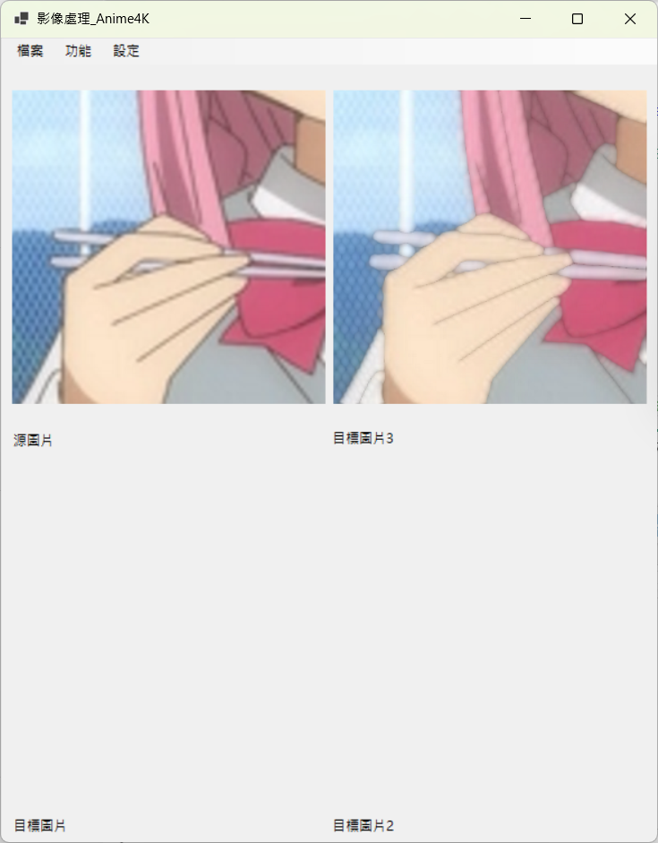
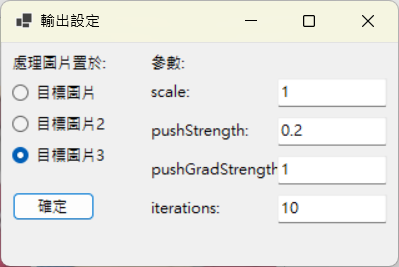
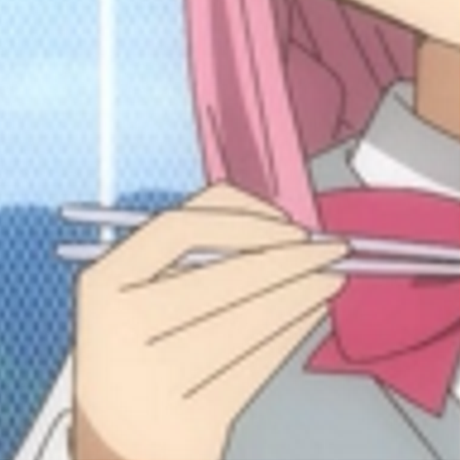
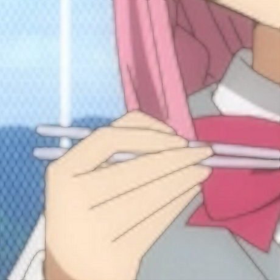
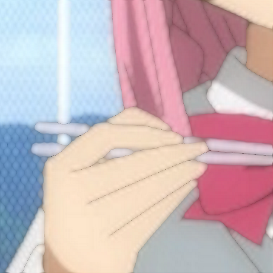

## Anime4K C# (WinForms)

以 C#/.NET 9 實作的 Windows Forms 影像放大與 Anime4K 風格強化工具。靈感與演算法理念來源：[`bloc97/Anime4K`](https://github.com/bloc97/Anime4K)。

---

### Demo（介面與結果）

介面與設定：

<p align="center">
  
  <br/>
  
  <br/>
  <em>介面與設定視窗示意</em>
  
</p>

處理結果（原圖 vs 迭代 5 與 10 次）：

<table>
  <tr>
    <th>Original</th>
    <th>Iteration = 5</th>
    <th>Iteration = 10</th>
  </tr>
  <tr>
    <td></td>
    <td></td>
    <td></td>
  </tr>
  <tr>
    <td align="center">原始圖片</td>
    <td align="center">迭代 5 次</td>
    <td align="center">迭代 10 次</td>
  </tr>
  <tr>
    <td colspan="3" align="center"><em>更多迭代通常會帶來更強的收線與銳利度，但也可能提升邊緣對比，請依來源圖調參。</em></td>
  </tr>
  
</table>

---

### 特色
- 放大：最近鄰、雙線性、雙三次
- Anime4K 風格強化：方向性三點混合、亮度/梯度遮罩、線性空間混色、可迭代
- 邊緣保護：梯度門檻 + γ 曲線抑制平坦區，限制單通道變化量避免跨邊擴散
- 最終銳化：Unsharp Mask 輕量收線
- 參數可從 UI 調整：`scale`、`pushStrength`、`pushGradStrength`、`iterations`

> 注意：本專案為 CPU 版實作（`System.Drawing` + LockBits），著重可讀性與可調性；原作使用 GPU GLSL，在品質與效能上更具優勢。

---

### 安裝需求
- Windows 7 (6.1) 以上
- .NET SDK 9（或相容）

### 建置與執行
```cmd
cd "Digital_Image_Processing_HW3"
dotnet build -c Release
```
輸出：`Digital_Image_Processing_HW3\bin\Release\net9.0-windows\Digital_Image_Processing_HW3.exe`

自包含發佈（單檔）：
```cmd
dotnet publish Digital_Image_Processing_HW3/Digital_Image_Processing_HW3.csproj ^
  -c Release -r win-x64 --self-contained true ^
  -p:PublishSingleFile=true -p:IncludeNativeLibrariesForSelfExtract=true
```

---

### 使用方式
1) 檔案 → 開啟圖片
2) 設定 → 調整參數並選擇輸出視窗
3) 功能 → 選擇演算法（最近鄰/雙線性/雙三次/Anime4K）
4) 於視窗中檢視結果並可另存

---

### 參數
| 參數 | 說明 | 預設 | 建議範圍 |
|---|---|---|---|
| scale | 放大倍率 | 2.0 | 1.0~4.0 |
| pushStrength | 顏色推進強度 | 0.20 | 0.12~0.30 |
| pushGradStrength | 梯度收線強度 | 0.40 | 0.30~0.60 |
| iterations | 疊代次數 | 2 | 1~3 |

內部常數（非 UI）：`gradThreshold≈24`、`gradGamma≈1.5`、單通道最大變化量 `≈8`。

---

### 演算法概覽（本專案版本）
流程：放大 → 多次方向性增強 → Unsharp Mask。

- 亮度遮罩（Rec.709）與梯度遮罩（Sobel）
  - `ComputeLuminanceMask`/`ComputeGradientMask` 產生 0..255 遮罩
- 方向性三點混合（線性空間）
  - `CombinedDirectionalPushLinear`：
    - 4 組對稱方向（0/4、1/5、2/6、3/7）候選
    - 僅在亮/暗條件成立的可信方向更新
    - 梯度權重：門檻 + γ 曲線（抑制平坦區）
    - 線性空間混合，並限制單通道變化量
- 最終銳化
  - `UnsharpMask` 以 3x3 高斯近似做輕量收線

品質小訣竅：
- 來源畫質佳時，`pushStrength` 偏低、`pushGradStrength` 偏中即可；
- 若邊緣仍軟，可降通道變化量或提高梯度門檻；
- 迭代 2~3 次常見即可，太多可能過度强化。

---

### 專案結構（節錄）
```
Digital_Image_Processing_HW3/
├── Anime4K.cs            # 影像處理核心（ImageProcess）
├── FileProcessing.cs     # 檔案存取
├── Form1.cs              # 主視窗
├── Form2.cs              # 設定視窗
└── Form3.cs              # 全圖檢視
```

---

### 相容性
- 僅支援 Windows。`System.Drawing` 在非 Windows 平台功能受限。
- 本專案已於組件層宣告 Windows 平台以抑制 CA1416 警告。

### 參考與致謝
- 原作與理念：[`bloc97/Anime4K`](https://github.com/bloc97/Anime4K)（MIT）

### 授權
僅供課程報告與研究用途；若要二次發佈或商用，請先徵得作者同意。


